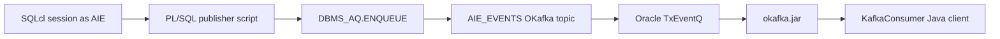

# AIE TxEventQ OKafka Demo

Reproducible guide for creating an Oracle TxEventQ topic that can be consumed by Kafka-style clients through Oracle OKafka, publishing messages from PL/SQL, and preparing the next step: a Java consumer based on `okafka.jar`.

## Demo Video

<video controls src="./TxEventQ.mov" title="TxEventQ OKafka PL/SQL producer demo"></video>

If the video does not render inline, open [TxEventQ.mov](./TxEventQ.mov).

The recording shows two command-line sessions: one starts the OKafka consumer, and the other runs the SQLcl publisher. When the PL/SQL script enqueues messages into `AIE_EVENTS`, the Java client receives and prints them as Kafka-style records.

## Use Case: Database Changes as Kafka-Style Events

A common integration requirement is to react to changes that already happen inside Oracle Database: an order is inserted, a payment changes state, or a business table is updated by an existing application. In that model, a database trigger or a PL/SQL package captures the change at the transaction boundary and publishes a compact JSON event to a queue.

This demo shows that pattern with Oracle TxEventQ created as an OKafka-compatible topic. The PL/SQL publisher enqueues JSON messages into `AIE_EVENTS`; a remote Java client uses the Kafka consumer API through Oracle OKafka to receive those events. The remote client keeps Kafka concepts such as topic, consumer group, offset, partition assignment, and poll loop, while the event stream is backed by Oracle Database instead of an external Kafka broker.

The included SQL publisher is intentionally a standalone SQLcl script so the flow is easy to reproduce. In a production design, the same enqueue logic would normally live behind a small PL/SQL package invoked by a trigger or by application code after the business change is validated.

## 1. Executive Summary

This demo creates a topic named `AIE_EVENTS` in the `AIE` schema.

The topic is not created as a generic AQ queue. It is created as an **OKafka topic** using `DBMS_AQADM.CREATE_DATABASE_KAFKA_TOPIC`, because the target consumer is a Kafka API client using Oracle OKafka's `KafkaConsumer`.

Oracle OKafka does not connect to an external Kafka broker. The Java client runs with `okafka.jar`, uses Kafka-style APIs, and internally accesses Oracle Database through JDBC/AQ-JMS to operate on TxEventQ.

## 2. Demo Architecture



Components:

| Component | Role in the demo |
|---|---|
| `AIE` | Schema that owns the topic and the demo messages. |
| `AIE_EVENTS` | OKafka topic backed by a multi-consumer TxEventQ. |
| `03_grant_okafka_client_prereqs.sql` | Grants OKafka runtime prerequisites to `AIE`; run as `ADMIN`. |
| `01_create_okafka_topic.sql` | Creates the topic that OKafka consumers can read. |
| `02_publish_messages.sql` | Publishes JSON events from PL/SQL. |
| `00_reset_demo.sql` | Drops the topic and underlying objects to restart the demo. |
| OKafka client | Java client that consumes the topic using Kafka-style APIs. |

## 3. Oracle References

The implementation is based on the official Oracle documentation:

- Oracle AI Database Transactional Event Queues and Advanced Queuing User's Guide 26ai:
  https://docs.oracle.com/en/database/oracle/oracle-database/26/adque/
- Changes in This Release:
  https://docs.oracle.com/en/database/oracle/oracle-database/26/adque/rel-changes.html
- Kafka APIs for Oracle Transactional Event Queues:
  https://docs.oracle.com/en/database/oracle/oracle-database/26/adque/Kafka_cient_interface_TEQ.html
- `DBMS_AQADM` package reference:
  https://docs.oracle.com/en/database/oracle/oracle-database/26/arpls/DBMS_AQADM.html
- `DBMS_AQ` package reference:
  https://docs.oracle.com/en/database/oracle/oracle-database/26/arpls/DBMS_AQ.html
- AQ operations using PL/SQL:
  https://docs.oracle.com/en/database/oracle/oracle-database/26/adque/aq-operations-using-pl-sql.html

## 4. Why This Queue Is Different

Oracle supports several queue and event patterns. This demo specifically requires compatibility with Kafka consumers, so the object must be created as an OKafka topic.

| Option | How it is created | Natural client | Suitable for OKafka |
|---|---|---|---|
| Generic AQ/TxEventQ | `CREATE_QUEUE_TABLE`, `CREATE_QUEUE`, or general TxEventQ APIs | PL/SQL `DBMS_AQ`, JMS, OCI, JDBC AQ | Not necessarily |
| OKafka topic | `DBMS_AQADM.CREATE_DATABASE_KAFKA_TOPIC` or OKafka KafkaAdmin | OKafka `KafkaProducer`, `KafkaConsumer`, `AdminClient` | Yes |

The practical difference matters:

- A Kafka consumer expects a **topic** with partition, offset, consumer group, and record semantics.
- A generic AQ client typically works with queues, subscribers, payload types, and AQ dequeue options.
- OKafka maps the Kafka model to Oracle TxEventQ. For that mapping to work correctly, the topic must be created as an OKafka topic.
- In this demo, the topic is backed by a multi-consumer TxEventQ with an internal `JMS_BYTES` payload type.

## 5. Granting OKafka Client Prerequisites

Script:

```bash
scripts/03_grant_okafka_client_prereqs.sql
```

Run as `ADMIN` or another privileged user:

```bash
sql -S -L -name admin_adbdev2 @scripts/03_grant_okafka_client_prereqs.sql
```

Oracle OKafka consumers need more than the queue/topic object. They also need privileges that allow OKafka to discover database sessions, instances, listener endpoints, PDB metadata, Resource Manager metadata, and TxEventQ partition assignments. The script follows the privilege list published in the `oracle/okafka` project README.

The script grants:

```sql
grant AQ_USER_ROLE to AIE;
grant execute on DBMS_AQ to AIE;
grant execute on DBMS_AQADM to AIE;
grant execute on DBMS_AQIN to AIE;
grant execute on DBMS_TEQK to AIE;
grant select on SYS.GV_$SESSION to AIE;
grant select on SYS.V_$SESSION to AIE;
grant select on SYS.GV_$INSTANCE to AIE;
grant select on SYS.GV_$LISTENER_NETWORK to AIE;
grant select on SYS.GV_$PDBS to AIE;
grant select on SYS.DBA_RSRC_PLAN_DIRECTIVES to AIE;
```

It also runs:

```sql
DBMS_AQADM.GRANT_PRIV_FOR_RM_PLAN('AIE');
```

Autonomous Database `ADMIN` may not be allowed to grant `SYS.USER_QUEUE_PARTITION_ASSIGNMENT_TABLE` directly. The script treats that as a warning because `AIE` can still query `USER_QUEUE_PARTITION_ASSIGNMENT_TABLE` in its own schema.

Important operational note: apply these prerequisites before creating the OKafka topic. If they are applied after the topic already exists, reset and recreate the topic:

```bash
sql -S -L -name AIE @scripts/00_reset_demo.sql
sql -S -L -name AIE @scripts/01_create_okafka_topic.sql
```

During validation, the consumer only started assigning real partitions after the prerequisites were granted and the topic was recreated.

## 6. Creating the Kafka-Compatible Topic

Script:

```bash
scripts/01_create_okafka_topic.sql
```

Run from SQLcl:

```sql
@scripts/01_create_okafka_topic.sql
```

Main operation:

```sql
DBMS_AQADM.CREATE_DATABASE_KAFKA_TOPIC(
  topicname                 => 'AIE_EVENTS',
  partition_num             => 3,
  retentiontime             => 7 * 24 * 3600,
  partition_assignment_mode => 2,
  replication_mode          => DBMS_AQADM.NONE
);
```

Parameters:

| Parameter | Value | Reason |
|---|---:|---|
| `topicname` | `AIE_EVENTS` | Topic name used by the OKafka consumer. |
| `partition_num` | `3` | Three logical partitions for the demo. |
| `retentiontime` | `604800` | Seven-day retention, in seconds. |
| `partition_assignment_mode` | `2` | Required for the OKafka topic created through `DBMS_AQADM`. |
| `replication_mode` | `DBMS_AQADM.NONE` | Local demo with no topic replication. |

The script is idempotent: if `AIE_EVENTS` already exists, it does not recreate it.

## 7. Topic Validation

The creation script checks `USER_QUEUES` and `USER_QUEUE_TABLES`.

Validated result in this demo:

| Field | Value |
|---|---|
| `USER_QUEUES.NAME` | `AIE_EVENTS` |
| `USER_QUEUES.QUEUE_TABLE` | `AIE_EVENTS` |
| `USER_QUEUES.QUEUE_TYPE` | `NORMAL_QUEUE` |
| `USER_QUEUES.ENQUEUE_ENABLED` | `YES` |
| `USER_QUEUES.DEQUEUE_ENABLED` | `YES` |
| `USER_QUEUES.SHARDED` | `TRUE` |
| `USER_QUEUE_TABLES.TYPE` | `JMS_BYTES` |

The `JMS_BYTES` type is important because the PL/SQL publisher must build the payload as `SYS.AQ$_JMS_BYTES_MESSAGE`.

## 8. Publishing from PL/SQL

Script:

```bash
scripts/02_publish_messages.sql
```

Run from SQLcl:

```sql
@scripts/02_publish_messages.sql
```

The script publishes 10 JSON messages into `AIE_EVENTS`.

### 8.1 Connection

The script does not open a connection by itself. It must run inside a SQLcl session already connected as `AIE`.

Example using a saved SQLcl connection:

```bash
sql -S -L -name AIE @scripts/02_publish_messages.sql
```

The connected user must have:

- `EXECUTE` on `DBMS_AQ`.
- `EXECUTE` on `DBMS_AQADM`.
- Permission to use its own queue/topic in the `AIE` schema.

In this demo, `AIE` owns the topic, so it publishes to `AIE_EVENTS` without using another schema prefix.

### 8.2 Pre-Publish Checks

Before publishing, the script checks:

1. A queue/topic named `AIE_EVENTS` exists.
2. Its queue table uses payload type `JMS_BYTES`.

If the topic does not exist, the script fails with:

```text
Topic AIE_EVENTS does not exist. Run scripts/01_create_okafka_topic.sql first.
```

If the payload type is not `JMS_BYTES`, the script fails because this publisher is written for `SYS.AQ$_JMS_BYTES_MESSAGE`.

### 8.3 Payload Construction

Each message is built as JSON:

```json
{
  "eventId": "AIE_EVT_...",
  "eventType": "ORDER_CREATED",
  "source": "PLSQL_DBMS_AQ",
  "topic": "AIE_EVENTS",
  "eventKey": "AIE_KEY_0001",
  "oracleShardId": 0,
  "sequence": 1,
  "customerId": "CUST-0002",
  "orderId": "ORD-000001",
  "amount": 112.75,
  "currency": "EUR",
  "createdAt": "2026-06-10T10:09:00.702Z"
}
```

The JSON is converted into a JMS bytes message as follows:

```sql
l_payload := SYS.AQ$_JMS_BYTES_MESSAGE.CONSTRUCT;
l_payload.SET_BYTES(UTL_RAW.CAST_TO_RAW(l_event_json));
```

The script uses `SET_BYTES`, not `WRITE_BYTES`.

Reason: in this database, the real specification of `SYS.AQ$_JMS_BYTES_MESSAGE` shows that `SET_BYTES` accepts `RAW` directly. `WRITE_BYTES` belongs to the JMS/JVM operation-id model and raised `PLS-00306` when used directly from this PL/SQL publisher.

### 8.4 JMS and AQ Properties

The script adds JMS properties to the payload:

```sql
l_payload.SET_STRING_PROPERTY('content_type', 'application/json');
l_payload.SET_STRING_PROPERTY('source', 'plsql');
l_payload.SET_STRING_PROPERTY('event_type', 'ORDER_CREATED');
l_payload.SET_STRING_PROPERTY('event_key', l_event_key);
```

It also sets AQ message properties:

```sql
l_message_props := DBMS_AQ.MESSAGE_PROPERTIES_T();
l_message_props.correlation := l_event_key;
l_message_props.expiration  := DBMS_AQ.NEVER;
l_message_props.shardid     := l_shard_id;
```

`correlation` provides a logical message identifier. `event_key` mirrors that key as a JMS property for easier diagnostics from consumers.

## 9. Why the Shard Must Be Provided

`AIE_EVENTS` is an OKafka topic backed by a partitioned/sharded TxEventQ. For this type of queue, Oracle must know which internal shard receives each message.

During implementation, publishing without `SHARDID` returned:

```text
ORA-25600: Invalid shard: Input shard does not match with shard in the queue
```

Therefore the script explicitly sets:

```sql
l_message_props.shardid := l_shard_id;
```

For this demo, a no-commit test validated values `0` through `5`:

| Tested `SHARDID` | Result |
|---:|---|
| `0` | OK |
| `1` | OK |
| `2` | OK |
| `3` | OK |
| `4` | OK |
| `5` | OK |
| `6` | `ORA-25600` |
| `7` | `ORA-25600` |
| `8` | `ORA-25600` |

The script rotates messages with:

```sql
l_shard_id := MOD(i - 1, c_shard_count);
```

where:

```sql
c_shard_count CONSTANT PLS_INTEGER := 6;
```

Important note: the logical `SHARDID` passed to `DBMS_AQ.ENQUEUE` does not have to appear exactly as the physical `SHARD` column value in the internal topic table.

In this demo's verification:

| Physical column `AIE_EVENTS.SHARD` | Messages |
|---:|---:|
| `0` | `4` |
| `2` | `4` |
| `4` | `2` |

This is consistent with a topic created with 3 partitions, even though the accepted `SHARDID` range for `DBMS_AQ.ENQUEUE` was `0..5`.

## 10. Enqueue and Commit

The main publish call is:

```sql
DBMS_AQ.ENQUEUE(
  queue_name         => c_topic_name,
  enqueue_options    => l_enqueue_options,
  message_properties => l_message_props,
  payload            => l_payload,
  msgid              => l_msgid
);
```

Enqueue options:

```sql
l_enqueue_options.visibility    := DBMS_AQ.ON_COMMIT;
l_enqueue_options.delivery_mode := DBMS_AQ.PERSISTENT;
```

Implications:

- `ON_COMMIT`: messages are part of the current transaction.
- `PERSISTENT`: messages are stored durably.
- Final `COMMIT`: messages become visible to consumers.

The script performs a single commit at the end:

```sql
COMMIT;
```

## 11. Resetting the Demo

Script:

```bash
scripts/00_reset_demo.sql
```

Run:

```sql
@scripts/00_reset_demo.sql
```

This script executes:

```sql
DBMS_AQADM.DROP_DATABASE_KAFKA_TOPIC(
  topicname => 'AIE_EVENTS'
);
```

It drops the OKafka topic and its underlying objects. It also removes pending messages. After reset, run the scripts in this order:

```sql
@scripts/01_create_okafka_topic.sql
@scripts/02_publish_messages.sql
```

## 12. Validated State

Current validated state from the build:

| Validation | Result |
|---|---|
| Topic created | `AIE_EVENTS` |
| Queue type | `NORMAL_QUEUE` |
| Sharded | `TRUE` |
| Payload type | `JMS_BYTES` |
| Messages published | `10` |
| Messages consumed by OKafka | `10` |
| Publish transaction | `COMMIT` completed |
| Physical distribution | `SHARD 0=4`, `SHARD 2=4`, `SHARD 4=2` |

## 13. Troubleshooting

| Symptom | Likely cause | Fix |
|---|---|---|
| `Topic AIE_EVENTS does not exist` | Creation script was not run | Run `01_create_okafka_topic.sql`. |
| `PLS-00306` on `WRITE_BYTES` | Wrong method signature for direct PL/SQL use | Use `SET_BYTES(UTL_RAW.CAST_TO_RAW(...))`. |
| `ORA-25600 Invalid shard` | Missing `message_properties.shardid` or invalid value | Use the validated `0..5` range for this demo. |
| OKafka consumer cannot see the topic | Topic was created as a generic AQ/TxEventQ queue, not as an OKafka topic | Create it with `DBMS_AQADM.CREATE_DATABASE_KAFKA_TOPIC`. |
| Consumer initially assigns `AIE_EVENTS--1` | OKafka rebalance has not completed yet | Keep the consumer running for a few minutes; if it never rebalances, run `04_diagnose_okafka_topic.sql` and then reset/recreate only if no real partitions appear. |
| Java client cannot resolve `<adb-host>` | Network/DNS is blocked in the execution sandbox | Run the client from a normal shell with outbound network access. |
| Consumer reads unexpected bytes | Wrong deserializer | Use `StringDeserializer` for the JSON value published as UTF-8 bytes. |

## 14. Wallet for the OKafka Client

The Autonomous Database wallet is a local runtime dependency and must not be committed to Git.

The recommended launcher, `./run_consumer.sh`, checks whether the extracted wallet exists under:

```text
wallet/tns_admin
```

If it is missing, the launcher asks for either:

- the path to an Autonomous Database wallet ZIP, or
- the path to an already extracted wallet directory.

It then copies/extracts the wallet locally, applies restrictive permissions, reads the selected TNS alias from `tnsnames.ora`, and derives the OKafka connection values at runtime.

The optional OKafka SSL template uses placeholders:

```properties
security.protocol=SSL
oracle.net.tns_admin=wallet/tns_admin
bootstrap.servers=<adb-host>:1522
oracle.service.name=<adb-service-name>
tns.alias=<wallet-tns-alias>
```

Credentials are not stored in the template. The launcher stores the local database password in `.pwd.txt` if it does not already exist.

Do not commit or expose wallet contents or `.pwd.txt` in public artifacts.

## 15. OKafka Java Consumer

The demo now includes a Java consumer based on Oracle OKafka:

```text
client/okafka-consumer
```

For day-to-day demo execution, use the repository-level helper:

```bash
./run_consumer.sh
```

On first run, it prepares the wallet under `wallet/tns_admin` if missing and creates a local `.pwd.txt` file for the `AIE` database password. Both wallet material and `.pwd.txt` are ignored by Git.

The consumer uses:

| Item | Value |
|---|---|
| Maven artifact | `com.oracle.database.messaging:okafka:23.7.0.0` |
| Main class | `com.oracle.demo.aie.okafka.AieOkafkaConsumer` |
| Default topic | `AIE_EVENTS` |
| Default consumer group | `AIE_OKAFKA_CONSUMER_DEMO` |
| Default max messages | Unlimited (`0`) |
| Default idle timeout | Disabled |
| Wallet directory | `wallet/tns_admin` |
| TNS alias | `<wallet-tns-alias>` |

Oracle OKafka exposes Kafka-style Java APIs, but it does not connect to a Kafka broker. The client imports Oracle's implementation:

```java
import org.oracle.okafka.clients.consumer.KafkaConsumer;
```

and still uses the standard Kafka consumer abstractions for records, offsets, partitions, consumer groups, and deserializers.

### 15.1 Maven Dependencies

The project only declares the OKafka dependency:

```xml
<dependency>
  <groupId>com.oracle.database.messaging</groupId>
  <artifactId>okafka</artifactId>
  <version>23.7.0.0</version>
</dependency>
```

Maven resolves the transitive dependencies, including Oracle JDBC, AQ API, Oracle PKI, JMS, JTA, Kafka clients, and SLF4J API.

### 15.2 Connection Configuration

The default configuration file is:

```text
client/okafka-consumer/config/consumer.properties
```

Important properties:

```properties
security.protocol=SSL
bootstrap.servers=<adb-host>:1522
oracle.service.name=<adb-service-name>
oracle.net.tns_admin=wallet/tns_admin
tns.alias=<wallet-tns-alias>
group.id=AIE_OKAFKA_CONSUMER_DEMO
partition.assignment.strategy=org.oracle.okafka.clients.consumer.TxEQAssignor
default.api.timeout.ms=180000
key.deserializer=org.apache.kafka.common.serialization.StringDeserializer
value.deserializer=org.apache.kafka.common.serialization.StringDeserializer
```

For Autonomous Database, OKafka uses SSL and the wallet directory through `oracle.net.tns_admin`.

The wallet does not store the `AIE` database password. The run scripts read the password from the `OKAFKA_PASSWORD` environment variable. At runtime, they create a temporary `TNS_ADMIN` directory, copy the wallet files there, write a temporary `ojdbc.properties` file with the user/password, pass that directory to Java, and delete it when the process exits.

This keeps the committed demo files free of credentials while still matching the OKafka/JDBC wallet model.

### 15.3 Recommended Run Script

From the repository root:

```bash
./run_consumer.sh
```

The default configuration waits for records without an idle timeout and without a message limit. For live demos, start the consumer first, publish messages from SQLcl in another terminal, and stop the consumer with `Ctrl+C` when the demo is complete.

Optional consumer arguments can be passed through:

```bash
./run_consumer.sh --max-messages=10
./run_consumer.sh --idle-timeout-seconds=120
./run_consumer.sh --group-id=CGAIE$(date +%s)
```

### 15.4 Option 1: Run with Maven

```bash
cd client/okafka-consumer
export OKAFKA_PASSWORD='<AIE-password>'
./bin/run-mvn-exec.sh
```

The script sets `JAVA_HOME` to a local JDK because the default `java` command on this host points to a JRE.

### 15.5 Option 2: Build and Run an Executable JAR

```bash
cd client/okafka-consumer
./bin/build-jar.sh
export OKAFKA_PASSWORD='<AIE-password>'
./bin/run-jar.sh
```

The generated executable JAR is:

```text
client/okafka-consumer/target/aie-okafka-consumer.jar
```

### 15.6 Useful Runtime Overrides

Use a different consumer group to read existing messages again from the beginning:

```bash
./bin/run-mvn-exec.sh --group-id=CGAIE$(date +%s)
```

Stop automatically after the demo batch:

```bash
./bin/run-mvn-exec.sh --max-messages=10
```

Enable an idle timeout only when an automatic exit is desired:

```bash
./bin/run-mvn-exec.sh --idle-timeout-seconds=120
```

Use a different configuration file:

```bash
./bin/run-mvn-exec.sh --config=/path/to/consumer.properties
```

Equivalent overrides can also be passed to `./bin/run-jar.sh`.

## 16. End-to-End Test

To test the full demo from a clean state:

```bash
sql -S -L -name admin_adbdev2 @scripts/03_grant_okafka_client_prereqs.sql
sql -S -L -name AIE @scripts/00_reset_demo.sql
sql -S -L -name AIE @scripts/01_create_okafka_topic.sql
```

Start the consumer in one terminal:

```bash
./run_consumer.sh
```

Then publish messages from another terminal:

```bash
sql -S -L -name AIE @scripts/02_publish_messages.sql
```

Expected result:

- The consumer subscribes to `AIE_EVENTS`.
- The consumer may initially show `AIE_EVENTS--1`, then rebalance to the real topic partitions.
- It prints each JSON event published by the PL/SQL script.
- It shows Kafka-style metadata such as topic, partition, offset, timestamp, key, and headers.
- It commits the consumed batch.
- It keeps waiting by default until the presenter stops it with `Ctrl+C`.

If the consumer stays on `AIE_EVENTS--1` for several minutes, run:

```bash
sql -S -L -name AIE @scripts/04_diagnose_okafka_topic.sql
```

The diagnostic query shows whether `USER_QUEUE_PARTITION_ASSIGNMENT_TABLE` contains real partition ids or only the placeholder `-1`. A placeholder assignment can be transient; in observed runs OKafka rebalanced after a few minutes and then consumed the backlog.

The diagnostic script is read-only and metadata-focused. It intentionally does not call direct AQ browse/dequeue because that was observed to coincide with OKafka rebalance events.

With a fresh `group.id` and `auto.offset.reset=earliest`, the consumer reads retained backlog. For a clean 10-message demo, reset and recreate the topic before starting the consumer.

Validated result from the build: after applying the OKafka prerequisites, resetting/recreating the topic, starting the Java consumer, and publishing from PL/SQL, the consumer read and committed 10 JSON messages from `AIE_EVENTS`.
