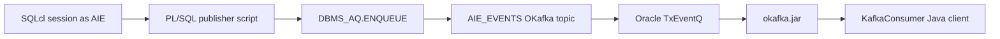

# AIE TxEventQ OKafka Demo

Guia de reproduccion para crear un topic TxEventQ compatible con consumidores Kafka mediante OKafka, publicar mensajes desde PL/SQL y preparar la demo para un consumidor Java basado en `okafka.jar`.

## Video de la demo

<video controls src="../TxEventQ.mov" title="Demo TxEventQ OKafka con productor PL/SQL"></video>

Si el video no se renderiza embebido, abrir [TxEventQ.mov](../TxEventQ.mov).

La grabacion muestra dos sesiones de linea de comandos: una arranca el consumidor OKafka y la otra ejecuta el publisher con SQLcl. Cuando el script PL/SQL encola mensajes en `AIE_EVENTS`, el cliente Java los recibe y los muestra como records tipo Kafka.

## Introduccion

Esta demo se centra en un flujo concreto y reproducible:

- Crear un topic Oracle TxEventQ compatible con consumidores OKafka.
- Publicar mensajes JSON de ejemplo en ese topic desde PL/SQL.
- Consumir esos mensajes desde un cliente Java remoto usando APIs tipo Kafka mediante Oracle OKafka.

La demo no crea tablas de negocio, no detecta cambios en tablas, no define triggers y no implementa Change Data Capture. El productor es un script SQLcl independiente para que el comportamiento pueda ejecutarse, resetearse y revisarse sin anadir objetos especificos de una aplicacion.

Este patron encaja cuando la base de datos o la capa PL/SQL ya sabe que ha ocurrido un evento de negocio y quiere publicarlo de forma explicita. Algunos ejemplos son `ORDER_ACCEPTED`, `PAYMENT_APPROVED`, `BATCH_COMPLETED`, notificaciones operativas generadas por jobs programados o eventos de integracion emitidos por procedimientos almacenados despues de completar una operacion de negocio.

No es un sustituto de una plataforma CDC completa. Si el requisito es capturar cambios arbitrarios en tablas, replicar datos, preservar el orden transaccional en muchas tablas, sincronizar sistemas heterogeneos o mover cambios hacia plataformas analiticas, Oracle GoldenGate es una opcion arquitectonicamente mas adecuada. La documentacion de Oracle GoldenGate lo describe como una solucion para alta disponibilidad, integracion de datos en tiempo real, transactional change data capture, replicacion de datos, transformaciones y verificacion entre sistemas operacionales y analiticos.

## 1. Resumen ejecutivo

Esta demo crea un topic llamado `AIE_EVENTS` dentro del esquema `AIE`.

El topic no se crea como una cola AQ generica. Se crea como un **OKafka topic** usando `DBMS_AQADM.CREATE_DATABASE_KAFKA_TOPIC`, porque el objetivo es que un consumidor basado en las APIs de Kafka pueda leerlo con `KafkaConsumer` de Oracle OKafka.

Oracle OKafka no conecta contra un broker Kafka externo. El cliente Kafka se ejecuta con `okafka.jar`, usa APIs de Kafka en Java, y por debajo accede a Oracle Database mediante JDBC/AQ-JMS para operar sobre TxEventQ.

## 2. Arquitectura de la demo



Componentes:

| Componente | Rol en la demo |
|---|---|
| `AIE` | Esquema propietario del topic y de los mensajes de demo. |
| `AIE_EVENTS` | Topic OKafka respaldado por una TxEventQ multi-consumidor. |
| `03_grant_okafka_client_prereqs.sql` | Concede prerequisitos runtime OKafka a `AIE`; ejecutar como `ADMIN`. |
| `01_create_okafka_topic.sql` | Crea el topic compatible con consumidores OKafka. |
| `02_publish_messages.sql` | Publica eventos JSON desde PL/SQL. |
| `00_reset_demo.sql` | Borra el topic y sus objetos subyacentes para reiniciar la demo. |
| Cliente OKafka | Cliente Java que consume el topic con APIs tipo Kafka. |

## 3. Fuentes Oracle utilizadas

La implementacion se basa en la documentacion oficial de Oracle:

- Oracle AI Database Transactional Event Queues and Advanced Queuing User's Guide 26ai:
  https://docs.oracle.com/en/database/oracle/oracle-database/26/adque/
- Changes in This Release:
  https://docs.oracle.com/en/database/oracle/oracle-database/26/adque/rel-changes.html
- Kafka APIs for Oracle Transactional Event Queues:
  https://docs.oracle.com/en/database/oracle/oracle-database/26/adque/Kafka_cient_interface_TEQ.html
- `DBMS_AQADM` package reference:
  https://docs.oracle.com/en/database/oracle/oracle-database/26/arpls/DBMS_AQADM.html
- `DBMS_AQ` package reference:
  https://docs.oracle.com/en/database/oracle/oracle-database/26/arpls/DBMS_AQ.html
- AQ operations using PL/SQL:
  https://docs.oracle.com/en/database/oracle/oracle-database/26/adque/aq-operations-using-pl-sql.html
- Oracle GoldenGate 26ai documentation:
  https://docs.oracle.com/en/database/goldengate/core/26/

## 4. Por que esta cola es distinta

Oracle soporta varios patrones de colas y eventos. Para esta demo se necesita compatibilidad con consumidores Kafka, por lo que el topic debe crearse de forma especifica.

| Opcion | Como se crea | Cliente natural | Encaja para OKafka |
|---|---|---|---|
| AQ/TxEventQ generica | `CREATE_QUEUE_TABLE`, `CREATE_QUEUE` o APIs TxEventQ generales | PL/SQL `DBMS_AQ`, JMS, OCI, JDBC AQ | No necesariamente |
| OKafka topic | `DBMS_AQADM.CREATE_DATABASE_KAFKA_TOPIC` o KafkaAdmin OKafka | `KafkaProducer`, `KafkaConsumer`, `AdminClient` de OKafka | Si |

La diferencia practica es importante:

- Un consumidor Kafka espera un **topic** con semantica de particiones, offsets, grupos de consumo y records.
- Un cliente AQ generico suele trabajar con colas, subscribers, payload types y opciones de dequeue propias de AQ.
- OKafka traduce el modelo Kafka hacia Oracle TxEventQ. Para que esa traduccion sea correcta, el topic debe estar creado como OKafka topic.
- En esta demo, el topic queda respaldado por una TxEventQ multi-consumidor y payload interno `JMS_BYTES`.

## 5. Grants de prerequisitos OKafka

Script:

```bash
scripts/03_grant_okafka_client_prereqs.sql
```

Ejecucion como `ADMIN` o usuario privilegiado:

```bash
sql -S -L -name admin_adbdev2 @scripts/03_grant_okafka_client_prereqs.sql
```

Los consumidores Oracle OKafka necesitan mas que el objeto queue/topic. Tambien necesitan privilegios para descubrir sesiones, instancias, endpoints de listener, metadata de PDB, metadata de Resource Manager y asignaciones de particiones TxEventQ. El script sigue la lista de privilegios publicada en el README del proyecto `oracle/okafka`.

El script concede:

```sql
grant AQ_USER_ROLE to AIE;
grant execute on DBMS_AQ to AIE;
grant execute on DBMS_AQADM to AIE;
grant execute on DBMS_AQIN to AIE;
grant execute on DBMS_TEQK to AIE;
grant select on SYS.GV_$SESSION to AIE;
grant select on SYS.V_$SESSION to AIE;
grant select on SYS.GV_$INSTANCE to AIE;
grant select on SYS.GV_$LISTENER_NETWORK to AIE;
grant select on SYS.GV_$PDBS to AIE;
grant select on SYS.DBA_RSRC_PLAN_DIRECTIVES to AIE;
```

Tambien ejecuta:

```sql
DBMS_AQADM.GRANT_PRIV_FOR_RM_PLAN('AIE');
```

En Autonomous Database, `ADMIN` puede no tener permiso para conceder directamente `SYS.USER_QUEUE_PARTITION_ASSIGNMENT_TABLE`. El script lo trata como aviso porque `AIE` puede consultar `USER_QUEUE_PARTITION_ASSIGNMENT_TABLE` en su propio esquema.

Nota operativa importante: aplicar estos prerequisitos antes de crear el topic OKafka. Si se aplican despues de que el topic ya exista, hay que resetear y recrear:

```bash
sql -S -L -name AIE @scripts/00_reset_demo.sql
sql -S -L -name AIE @scripts/01_create_okafka_topic.sql
```

Durante la validacion, el consumidor solo empezo a asignar particiones reales despues de conceder los prerequisitos y recrear el topic.

## 6. Creacion del topic compatible con Kafka

Script:

```bash
scripts/01_create_okafka_topic.sql
```

Ejecucion desde SQLcl:

```sql
@scripts/01_create_okafka_topic.sql
```

Operacion principal:

```sql
DBMS_AQADM.CREATE_DATABASE_KAFKA_TOPIC(
  topicname                 => 'AIE_EVENTS',
  partition_num             => 3,
  retentiontime             => 7 * 24 * 3600,
  partition_assignment_mode => 2,
  replication_mode          => DBMS_AQADM.NONE
);
```

Parametros usados:

| Parametro | Valor | Motivo |
|---|---:|---|
| `topicname` | `AIE_EVENTS` | Nombre del topic que usara el consumidor OKafka. |
| `partition_num` | `3` | Tres particiones logicas para la demo. |
| `retentiontime` | `604800` | Retencion de 7 dias en segundos. |
| `partition_assignment_mode` | `2` | Requerido para el topic OKafka creado via `DBMS_AQADM`. |
| `replication_mode` | `DBMS_AQADM.NONE` | Demo local sin replicacion de topic. |

El script es idempotente: si `AIE_EVENTS` ya existe, no lo recrea.

## 7. Validacion del topic

El script de creacion consulta `USER_QUEUES` y `USER_QUEUE_TABLES`.

Resultado validado en esta demo:

| Campo | Valor |
|---|---|
| `USER_QUEUES.NAME` | `AIE_EVENTS` |
| `USER_QUEUES.QUEUE_TABLE` | `AIE_EVENTS` |
| `USER_QUEUES.QUEUE_TYPE` | `NORMAL_QUEUE` |
| `USER_QUEUES.ENQUEUE_ENABLED` | `YES` |
| `USER_QUEUES.DEQUEUE_ENABLED` | `YES` |
| `USER_QUEUES.SHARDED` | `TRUE` |
| `USER_QUEUE_TABLES.TYPE` | `JMS_BYTES` |

El tipo `JMS_BYTES` es relevante porque el publisher PL/SQL debe construir el mensaje como `SYS.AQ$_JMS_BYTES_MESSAGE`.

## 8. Publicacion desde PL/SQL

Script:

```bash
scripts/02_publish_messages.sql
```

Ejecucion desde SQLcl:

```sql
@scripts/02_publish_messages.sql
```

El script publica 10 mensajes JSON en `AIE_EVENTS`.

### 8.1 Conexion

El script no abre una conexion por si mismo. Se ejecuta dentro de una sesion SQLcl ya conectada al usuario `AIE`.

Ejemplo con una conexion guardada de SQLcl:

```bash
sql -S -L -name AIE @scripts/02_publish_messages.sql
```

El usuario conectado debe tener:

- `EXECUTE` sobre `DBMS_AQ`.
- `EXECUTE` sobre `DBMS_AQADM`.
- Permisos para usar su propia cola/topic en el esquema `AIE`.

En esta demo, `AIE` es el propietario del topic, por lo que publica sobre `AIE_EVENTS` sin prefijo de otro esquema.

### 8.2 Validaciones previas

Antes de publicar, el script comprueba:

1. Que existe una cola/topic llamada `AIE_EVENTS`.
2. Que su queue table usa payload type `JMS_BYTES`.

Si el topic no existe, el script falla con:

```text
Topic AIE_EVENTS does not exist. Run scripts/01_create_okafka_topic.sql first.
```

Si el payload no es `JMS_BYTES`, el script falla porque este publisher esta escrito para `SYS.AQ$_JMS_BYTES_MESSAGE`.

### 8.3 Construccion del payload

Cada mensaje se construye como JSON:

```json
{
  "eventId": "AIE_EVT_...",
  "eventType": "ORDER_CREATED",
  "source": "PLSQL_DBMS_AQ",
  "topic": "AIE_EVENTS",
  "eventKey": "AIE_KEY_0001",
  "oracleShardId": 0,
  "sequence": 1,
  "customerId": "CUST-0002",
  "orderId": "ORD-000001",
  "amount": 112.75,
  "currency": "EUR",
  "createdAt": "2026-06-10T10:09:00.702Z"
}
```

La conversion a mensaje JMS bytes se hace asi:

```sql
l_payload := SYS.AQ$_JMS_BYTES_MESSAGE.CONSTRUCT;
l_payload.SET_BYTES(UTL_RAW.CAST_TO_RAW(l_event_json));
```

Se usa `SET_BYTES`, no `WRITE_BYTES`.

Motivo: en esta base, la especificacion real de `SYS.AQ$_JMS_BYTES_MESSAGE` muestra que `SET_BYTES` acepta `RAW` directamente. `WRITE_BYTES` pertenece al modelo JMS/JVM con operation id y genero `PLS-00306` cuando se intento usarlo directamente desde este publisher PL/SQL.

### 8.4 Propiedades JMS y AQ

El script anade propiedades JMS al payload:

```sql
l_payload.SET_STRING_PROPERTY('content_type', 'application/json');
l_payload.SET_STRING_PROPERTY('source', 'plsql');
l_payload.SET_STRING_PROPERTY('event_type', 'ORDER_CREATED');
l_payload.SET_STRING_PROPERTY('event_key', l_event_key);
```

Y propiedades AQ:

```sql
l_message_props := DBMS_AQ.MESSAGE_PROPERTIES_T();
l_message_props.correlation := l_event_key;
l_message_props.expiration  := DBMS_AQ.NEVER;
l_message_props.shardid     := l_shard_id;
```

La correlacion (`correlation`) permite identificar logicamente el mensaje. El `event_key` replica esa clave en propiedades JMS para facilitar diagnostico desde consumidores.

## 9. Por que hay que indicar el shard

`AIE_EVENTS` es un topic OKafka respaldado por una TxEventQ particionada/sharded. En una cola de este tipo, Oracle debe saber en que shard interno se encola cada mensaje.

Durante la implementacion se probo publicar sin `SHARDID` y la base devolvio:

```text
ORA-25600: Invalid shard: Input shard does not match with shard in the queue
```

Por eso el script asigna explicitamente:

```sql
l_message_props.shardid := l_shard_id;
```

Para esta demo se validaron con una prueba sin commit los valores `0` a `5`:

| `SHARDID` probado | Resultado |
|---:|---|
| `0` | OK |
| `1` | OK |
| `2` | OK |
| `3` | OK |
| `4` | OK |
| `5` | OK |
| `6` | `ORA-25600` |
| `7` | `ORA-25600` |
| `8` | `ORA-25600` |

El script rota los mensajes asi:

```sql
l_shard_id := MOD(i - 1, c_shard_count);
```

con:

```sql
c_shard_count CONSTANT PLS_INTEGER := 6;
```

Nota importante: el `SHARDID` logico que se pasa a `DBMS_AQ.ENQUEUE` no tiene que verse igual que la columna fisica `SHARD` en la tabla interna del topic.

En la verificacion de esta demo:

| Columna fisica `AIE_EVENTS.SHARD` | Mensajes |
|---:|---:|
| `0` | `4` |
| `2` | `4` |
| `4` | `2` |

Esto es consistente con un topic creado con 3 particiones, aunque el rango de `SHARDID` aceptado por `DBMS_AQ.ENQUEUE` fuera `0..5`.

## 10. Enqueue y commit

La llamada principal de publicacion es:

```sql
DBMS_AQ.ENQUEUE(
  queue_name         => c_topic_name,
  enqueue_options    => l_enqueue_options,
  message_properties => l_message_props,
  payload            => l_payload,
  msgid              => l_msgid
);
```

Opciones de enqueue:

```sql
l_enqueue_options.visibility    := DBMS_AQ.ON_COMMIT;
l_enqueue_options.delivery_mode := DBMS_AQ.PERSISTENT;
```

Implicaciones:

- `ON_COMMIT`: los mensajes forman parte de la transaccion actual.
- `PERSISTENT`: los mensajes quedan almacenados de forma durable.
- `COMMIT` final: los mensajes pasan a estar visibles para consumidores.

El script hace un solo `COMMIT` al final:

```sql
COMMIT;
```

## 11. Reset de la demo

Script:

```bash
scripts/00_reset_demo.sql
```

Ejecucion:

```sql
@scripts/00_reset_demo.sql
```

Este script ejecuta:

```sql
DBMS_AQADM.DROP_DATABASE_KAFKA_TOPIC(
  topicname => 'AIE_EVENTS'
);
```

Esto borra el topic OKafka y sus objetos subyacentes. Tambien elimina los mensajes pendientes. Despues del reset, el orden correcto es:

```sql
@scripts/01_create_okafka_topic.sql
@scripts/02_publish_messages.sql
```

## 12. Estado validado

Estado actual validado durante la construccion:

| Validacion | Resultado |
|---|---|
| Topic creado | `AIE_EVENTS` |
| Tipo de cola | `NORMAL_QUEUE` |
| Sharded | `TRUE` |
| Payload type | `JMS_BYTES` |
| Mensajes publicados | `10` |
| Mensajes consumidos por OKafka | `10` |
| Publicacion | `COMMIT` completado |
| Distribucion fisica | `SHARD 0=4`, `SHARD 2=4`, `SHARD 4=2` |

## 13. Troubleshooting

| Sintoma | Causa probable | Correccion |
|---|---|---|
| `Topic AIE_EVENTS does not exist` | No se ejecuto el script de creacion | Ejecutar `01_create_okafka_topic.sql`. |
| `PLS-00306` en `WRITE_BYTES` | Firma incorrecta para uso directo PL/SQL | Usar `SET_BYTES(UTL_RAW.CAST_TO_RAW(...))`. |
| `ORA-25600 Invalid shard` | Falta `message_properties.shardid` o valor invalido | Usar el rango validado `0..5` para esta demo. |
| Consumidor OKafka no ve el topic | Topic creado como AQ/TxEventQ generica, no como OKafka topic | Crear con `DBMS_AQADM.CREATE_DATABASE_KAFKA_TOPIC`. |
| El consumidor asigna inicialmente `AIE_EVENTS--1` | El rebalanceo OKafka todavia no ha terminado | Dejar el consumidor ejecutando unos minutos; si nunca rebalancea, ejecutar `04_diagnose_okafka_topic.sql` y resetear/recrear solo si no aparecen particiones reales. |
| El cliente Java no resuelve `<adb-host>` | Red/DNS bloqueado por el sandbox de ejecucion | Ejecutar el cliente desde una shell normal con salida de red. |
| Consumidor lee bytes inesperados | Deserializador incorrecto | Usar `StringDeserializer` para el valor JSON publicado como bytes UTF-8. |

## 14. Wallet para el cliente OKafka

El wallet de Autonomous Database es una dependencia local de runtime y no debe subirse a Git.

El launcher recomendado, `./run_consumer.sh`, comprueba si el wallet extraido existe en:

```text
wallet/tns_admin
```

Si falta, el launcher pide:

- el path de un ZIP de wallet de Autonomous Database, o
- el path de un directorio de wallet ya extraido.

Despues copia/extrae el wallet localmente, aplica permisos restrictivos, lee el alias TNS desde `tnsnames.ora` y deriva los valores de conexion OKafka en runtime.

La plantilla SSL opcional usa placeholders:

```properties
security.protocol=SSL
oracle.net.tns_admin=wallet/tns_admin
bootstrap.servers=<adb-host>:1522
oracle.service.name=<adb-service-name>
tns.alias=<wallet-tns-alias>
```

Las credenciales no se guardan en la plantilla. El launcher guarda la password local de base de datos en `.pwd.txt` si no existe.

No se deben publicar ni exponer los contenidos del wallet ni `.pwd.txt` en artefactos publicos.

## 15. Consumidor Java OKafka

La demo ya incluye un consumidor Java basado en Oracle OKafka:

```text
client/okafka-consumer
```

Para la ejecucion habitual de la demo, usar el helper de la raiz del repositorio:

```bash
./run_consumer.sh
```

En la primera ejecucion prepara el wallet bajo `wallet/tns_admin` si falta y crea un fichero local `.pwd.txt` para la password de base de datos del usuario `AIE`. Tanto el material del wallet como `.pwd.txt` estan ignorados por Git.

El consumidor usa:

| Elemento | Valor |
|---|---|
| Artefacto Maven | `com.oracle.database.messaging:okafka:23.7.0.0` |
| Clase principal | `com.oracle.demo.aie.okafka.AieOkafkaConsumer` |
| Topic por defecto | `AIE_EVENTS` |
| Grupo consumidor por defecto | `AIE_OKAFKA_CONSUMER_DEMO` |
| Maximo de mensajes por defecto | Ilimitado (`0`) |
| Timeout de inactividad por defecto | Desactivado |
| Directorio del wallet | `wallet/tns_admin` |
| Alias TNS | `<wallet-tns-alias>` |

Oracle OKafka expone APIs Java de estilo Kafka, pero no conecta contra un broker Kafka. El cliente importa la implementacion de Oracle:

```java
import org.oracle.okafka.clients.consumer.KafkaConsumer;
```

y sigue usando las abstracciones estandar de Kafka para records, offsets, particiones, grupos de consumo y deserializadores.

### 15.1 Dependencias Maven

El proyecto solo declara la dependencia OKafka:

```xml
<dependency>
  <groupId>com.oracle.database.messaging</groupId>
  <artifactId>okafka</artifactId>
  <version>23.7.0.0</version>
</dependency>
```

Maven resuelve las dependencias transitivas, incluyendo Oracle JDBC, AQ API, Oracle PKI, JMS, JTA, Kafka clients y SLF4J API.

### 15.2 Configuracion de conexion

El fichero de configuracion por defecto es:

```text
client/okafka-consumer/config/consumer.properties
```

Propiedades principales:

```properties
security.protocol=SSL
bootstrap.servers=<adb-host>:1522
oracle.service.name=<adb-service-name>
oracle.net.tns_admin=wallet/tns_admin
tns.alias=<wallet-tns-alias>
group.id=AIE_OKAFKA_CONSUMER_DEMO
partition.assignment.strategy=org.oracle.okafka.clients.consumer.TxEQAssignor
default.api.timeout.ms=180000
key.deserializer=org.apache.kafka.common.serialization.StringDeserializer
value.deserializer=org.apache.kafka.common.serialization.StringDeserializer
```

Para Autonomous Database, OKafka usa SSL y el directorio del wallet mediante `oracle.net.tns_admin`.

El wallet no guarda la password de base de datos del usuario `AIE`. Los scripts de ejecucion leen la password desde la variable de entorno `OKAFKA_PASSWORD`. En runtime, crean un directorio temporal `TNS_ADMIN`, copian ahi los ficheros del wallet, escriben un `ojdbc.properties` temporal con usuario/password, pasan ese directorio a Java, y lo borran al terminar el proceso.

Asi los ficheros de la demo no contienen credenciales y se mantiene el modelo OKafka/JDBC con wallet.

### 15.3 Script recomendado

Desde la raiz del repositorio:

```bash
./run_consumer.sh
```

La configuracion por defecto espera mensajes sin timeout de inactividad y sin limite de mensajes. Para demos en vivo, arranca primero el consumidor, publica mensajes desde SQLcl en otra terminal, y para el consumidor con `Ctrl+C` cuando termine la demo.

Se pueden pasar argumentos opcionales al consumidor:

```bash
./run_consumer.sh --max-messages=10
./run_consumer.sh --idle-timeout-seconds=120
./run_consumer.sh --group-id=CGAIE$(date +%s)
```

### 15.4 Opcion 1: ejecutar con Maven

```bash
cd client/okafka-consumer
export OKAFKA_PASSWORD='<AIE-password>'
./bin/run-mvn-exec.sh
```

El script fija `JAVA_HOME` a un JDK local porque el comando `java` por defecto en esta maquina apunta a un JRE.

### 15.5 Opcion 2: construir y ejecutar un JAR

```bash
cd client/okafka-consumer
./bin/build-jar.sh
export OKAFKA_PASSWORD='<AIE-password>'
./bin/run-jar.sh
```

El JAR ejecutable generado queda en:

```text
client/okafka-consumer/target/aie-okafka-consumer.jar
```

### 15.6 Overrides utiles

Usar otro grupo consumidor para volver a leer mensajes existentes desde el principio:

```bash
./bin/run-mvn-exec.sh --group-id=CGAIE$(date +%s)
```

Terminar automaticamente despues del lote de la demo:

```bash
./bin/run-mvn-exec.sh --max-messages=10
```

Activar un timeout de inactividad solo cuando interese que el proceso termine automaticamente:

```bash
./bin/run-mvn-exec.sh --idle-timeout-seconds=120
```

Usar otro fichero de configuracion:

```bash
./bin/run-mvn-exec.sh --config=/path/to/consumer.properties
```

Los mismos overrides pueden pasarse a `./bin/run-jar.sh`.

## 16. Prueba end-to-end

Para probar la demo completa desde cero:

```bash
sql -S -L -name admin_adbdev2 @scripts/03_grant_okafka_client_prereqs.sql
sql -S -L -name AIE @scripts/00_reset_demo.sql
sql -S -L -name AIE @scripts/01_create_okafka_topic.sql
```

Arrancar el consumidor en una terminal:

```bash
./run_consumer.sh
```

Despues publicar mensajes desde otra terminal:

```bash
sql -S -L -name AIE @scripts/02_publish_messages.sql
```

Resultado esperado:

- El consumidor se suscribe a `AIE_EVENTS`.
- Puede mostrar inicialmente `AIE_EVENTS--1` y luego rebalancear hacia las particiones reales del topic.
- Imprime cada evento JSON publicado por el script PL/SQL.
- Muestra metadatos estilo Kafka como topic, particion, offset, timestamp, key y headers.
- Hace commit del batch consumido.
- Sigue esperando por defecto hasta que el presentador lo pare con `Ctrl+C`.

Si el consumidor se queda en `AIE_EVENTS--1` durante varios minutos, ejecutar:

```bash
sql -S -L -name AIE @scripts/04_diagnose_okafka_topic.sql
```

La consulta de diagnostico muestra si `USER_QUEUE_PARTITION_ASSIGNMENT_TABLE` contiene particiones reales o solo el placeholder `-1`. Una asignacion placeholder puede ser transitoria; en ejecuciones observadas OKafka rebalanceo despues de unos minutos y empezo a consumir el backlog.

El script de diagnostico es solo de lectura y centrado en metadata. Intencionadamente no llama a browse/dequeue directo por AQ porque se observo que podia coincidir con eventos de rebalance OKafka.

Con un `group.id` nuevo y `auto.offset.reset=earliest`, el consumidor lee backlog retenido. Para una demo limpia de 10 mensajes, resetear y recrear el topic antes de arrancar el consumidor.

Resultado validado en la construccion: tras aplicar los prerequisitos OKafka, resetear/recrear el topic, arrancar el consumidor Java y publicar desde PL/SQL, el consumidor leyo e hizo commit de 10 mensajes JSON de `AIE_EVENTS`.
